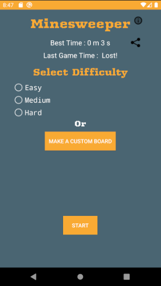
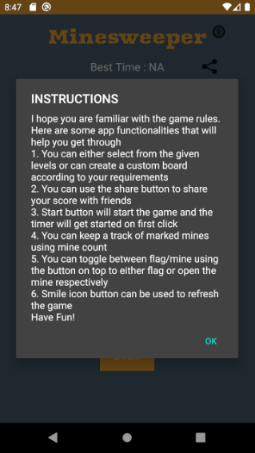
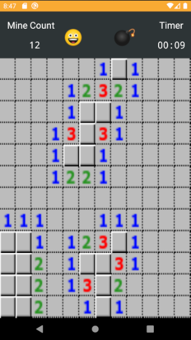

# Minesweeper
Minesweeper is a single-player puzzle video game. The objective of the game is to clear a rectangular board containing hidden "mines" or bombs without detonating any of them, with help from clues about the number of neighboring mines in each field.

This is an android application which is build using kotlin.

## First Screen

## Instructions

## Game Screen

# Features
- [x] Three different difficulty levels with an option to create custom board
- [x] Mines are set randomly on first click
- [x] Top bezel shows the mine count (Mines Left = number of mines - marked mines)
- [x] Option to mark-mine/open-mine using button in top bezel
- [x] Option to restart game anytime using the smile icon
- [x] Option to mark-mine/open-mine using button in top bezel
- [x] Instructions can be viewed by clicking on 'i' button on first page
- [x] Saves the best time and the last game time (if the last game status is lost, it shows lost)
- [x] Option to share best time with friends
